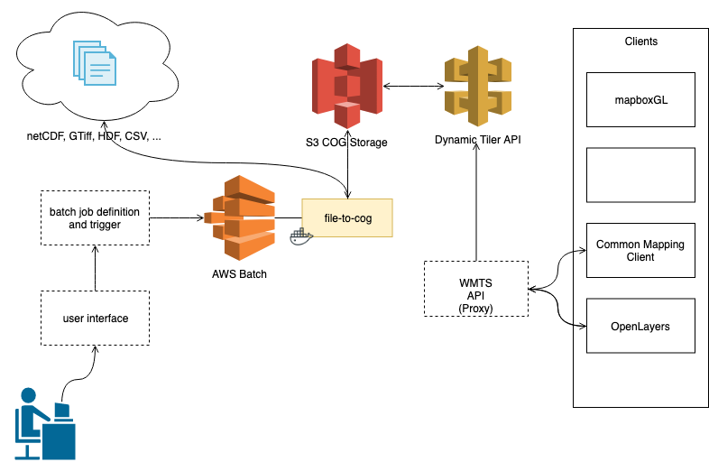

# COG Pipeline

WIP for generating COGs for different datasources and visualizing them using a dynamic tiler API.

Based off work of @vincentsarago

Planned architecture:

Potential target datasets:

* [GOLive](https://nsidc.org/data/NSIDC-0710/versions/1)
* [MUR SST](https://podaac-tools.jpl.nasa.gov/drive/files/allData/ghrsst/data/GDS2/L4/GLOB/JPL/MUR/v4.1)
* [Sentinnel](https://registry.opendata.aws/sentinel-2/)
